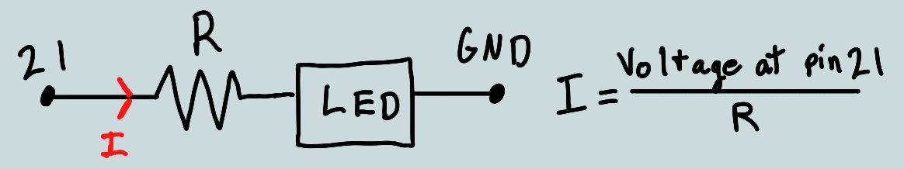

# Table of Contents

1.  [Introduction](#org6c61052)
    1.  [Welcome to the EECS Day Electrical Engineering lab!](#org5862145)
    2.  [Counting Systems](#org9246f4e)
    3.  [Overview of Our Circuit](#org3bf4092)
2.  [Materials](#orgd66d197)
    1.  [Microcontroller](#org907a20d)
    2.  [Breadboard](#org5a67f5d)
3.  [Putting it all together](#org60d9516)
    1.  [Microcontroller Diagram](#orga86f36c)
    2.  [Breadboard Diagram](#orge5b4ef4)
4.  [Instructions](#orgfb32b0d)
    1.  [Helpful Hints](#org3785df2)
5.  [Optional Extra Step](#org6b87bf6)
    1.  [Theory](#orgfc452d3)
    2.  [Equivalent Resistances](#org44388db)
    3.  [Your Task](#org9b143b5)
        1.  [Helpful Hints](#org00faa2b)

# Introduction

*Written by Bryan Ngo & Eric Macedo with contributions from Luca Poulos & Kelly Tou.*

## Welcome to the EECS Day Electrical Engineering lab!

Today, you will get a sneak peek into the life of an EECS student by building an interesting electronic circuit with us: a speed-controlled binary counter!
These instructions will guide you through the circuits purpose and how to build it.
For any further questions, refer to the lab instructors (we don&rsquo;t bite).

First, let&rsquo;s understand what a counting system is.

## Counting Systems

In daily life, we use the *decimal system*, or base-10, which has 10 unique digits (0, 1, 2, 3, 4, 5, 6, 7, 8, 9).
When we count, we increment the value of the rightmost digit until it reaches the maximum symbol (i.e. 9).
Then, we carry over to the next digit to the left and repeat the process until the desired number is reached.
This is called [positional notation](https://en.wikipedia.org/wiki/Positional_notation).
Similarly, a *binary system*, or base-2, only has 2 unique digits (0, 1) and works the same way as the decimal system.

Let&rsquo;s go through an example.
For the sake of notation, whenever a number is written in binary we put the prefix `0b` before the number.
Suppose we count from decimal 0 to decimal 7.
We start with 0 = `0b000` and 1 = `0b001`.
You can see that we are out of symbols for the right-most digit, so we go to the next left digit and add 1.
Therefore, 2 = `0b010` and 3 = `0b011`.

<table border="2" cellspacing="0" cellpadding="6" rules="groups" frame="hsides">

<colgroup>
<col  class="org-right" />

<col  class="org-left" />
</colgroup>
<thead>
<tr>
<th scope="col" class="org-right">Decimal</th>
<th scope="col" class="org-left">Binary</th>
</tr>
</thead>

<tbody>
<tr>
<td class="org-right">0</td>
<td class="org-left"><code>0b000</code></td>
</tr>

<tr>
<td class="org-right">1</td>
<td class="org-left"><code>0b001</code></td>
</tr>

<tr>
<td class="org-right">2</td>
<td class="org-left"><code>0b010</code></td>
</tr>

<tr>
<td class="org-right">3</td>
<td class="org-left"><code>0b011</code></td>
</tr>

<tr>
<td class="org-right">4</td>
<td class="org-left"><code>0b100</code></td>
</tr>

<tr>
<td class="org-right">5</td>
<td class="org-left"><code>0b101</code></td>
</tr>

<tr>
<td class="org-right">6</td>
<td class="org-left"><code>0b110</code></td>
</tr>

<tr>
<td class="org-right">7</td>
<td class="org-left"><code>0b111</code></td>
</tr>
</tbody>
</table>

Why is binary so important?
Every computer is composed of billions of tiny devices called [transistors](https://en.wikipedia.org/wiki/Transistor).
These transistors can be combined to create [logic gates](https://en.wikipedia.org/wiki/Logic_gate).
Logic gates are single-operation machines that, when given a number of inputs, return either **True** or **False**.
Can you see how we can model our transistors as binary numbers?
Let True be `0b1` and False be `0b0` - our computers count in binary!

For the mathematically inclined, for some base-$b$ counting system with a set of possible digits $d_i \in \{0, 1, \ldots, b - 1\}$, the number $n$ can be uniquely represented by the expression

\begin{equation}
n = \sum_{i = 0}^{b - 1} d_i b^i
\end{equation}

## Overview of Our Circuit

In our circuit, we will have four LEDs ([light emitting diodes](https://en.wikipedia.org/wiki/Light-emitting_diode)).
Each LED will behave as one binary digit (or bit).
An *on* LED corresponds to `0b1`, while an *off* LED corresponds to `0b0`.
Therefore, having all LEDs off represents `0b0000`, and having all LEDs on represents the number `0b1111` (convince yourself this equals 15).

When we turn on our circuit, our counter may count from 0 to 15 too fast for us to appreciate.
Thus, we will control its speed using a [potentiometer](https://en.wikipedia.org/wiki/Potentiometer).

# Materials

<table border="2" cellspacing="0" cellpadding="6" rules="groups" frame="hsides">

<colgroup>
<col  class="org-left" />

<col  class="org-left" />
</colgroup>
<thead>
<tr>
<th scope="col" class="org-left">Materials</th>
<th scope="col" class="org-left">Description</th>
</tr>
</thead>

<tbody>
<tr>
<td class="org-left"></td>
<td class="org-left">LED (4x): A light-emitting diode lights up when electricity passes through it. <b><b>Attention: The LED legs have different lengths, the long one being the positive one and the short one being negative; the orientation matters!</b></b></td>
</tr>

<tr>
<td class="org-left"></td>
<td class="org-left">Resistor (4x): A resistor is a device that restricts the flow of electric current into our LEDs, preventing them from overloading. The strength of a resistor is controlled by its resistance, which, in our case, is 1 kΩ (kilo-ohm). To verify your resistor is correct, check the color stripes are, in order, brown, black, red, and gold.</td>
</tr>

<tr>
<td class="org-left"></td>
<td class="org-left">Potentiometer (1x): A device that controls the voltage passing through it. In other words, it is a resistor you can change the value of! The middle pin is the output. From the two-pin side, the pin close to the marking is the input and the other one should be connected to ground.</td>
</tr>

<tr>
<td class="org-left"></td>
<td class="org-left">Microcontroller (1x): Our [Adafruit ESP32 Feather](<a href="https://www.adafruit.com/product/3591">https://www.adafruit.com/product/3591</a>) has an embedded computer that will control our circuit. We will go into more detail later. Note the Micro-USB port on the top. <b>We will pass these out to you after you come up to us and verify your circuit is correct.</b></td>
</tr>

<tr>
<td class="org-left"></td>
<td class="org-left">Breadboard (1x): A platform full of holes where you can stick wires and components to organize your circuit and prevent them from falling out. We will go into more detail later.</td>
</tr>

<tr>
<td class="org-left"></td>
<td class="org-left">Wires (At least 10).</td>
</tr>
</tbody>
</table>

## Microcontroller

Our microcontroller contains all the fancy tools we will need to make this circuit work.
It contains a computer and pins that can serve as the interface between the computer and our circuit.

Don&rsquo;t worry about software or coding the microcontroller, we will be uploading it for you.
If you want to see the code running on your ESP32, [here](./counter.ino) is a link. Here is a breakdown of what pins we will be using:

-   `3V`: This pin provides power to the potentiometer, specifically 3.3 V, despite the name. Notice that for the LEDs we will get electricity elsewhere.
-   `GND`: This is our ground terminal, indicated by the negative sign. Think of electricity as a bunch of electrons running through the wires. The electrons have to travel somewhere to complete the circuit, which is the purpose of ground. All our components in the circuit connect here.
-   `A0`, `A1`, `A5`, `21`: These are our analog output pins, which the computer can control the voltage level of. We will use them to power the LEDs.
-   `32`: This is an analog input, which we will use to measure the voltage from the potentiometer.

## Breadboard

The breadboard is the second most important part of the circuit, and any good circuit design starts on the breadboard.

First, on both sides we have the **Positive (+)** and **Negative (-)** rails.
They are connected to each other columnwise, and we connect the negative column to `GND` and the positive to any constant power source.
The other holes are connected in rows, though this connection does not cross the middle divide, as you can see below:

# Putting it all together

## Microcontroller Diagram

As described above, we have programmed a microcontroller to count from 0-15, where the number at any time is given by the binary number represented by the combination of voltages at pins `A0`, `A1`, `A5`, and `21`.

The counting speed of the microcontroller varies based on the voltage at pin `32`.
We will use our potentiometer to control the voltage at pin `32`, so we can control the counting speed of the microcontroller.

Below you will see a diagram of the circuit we are trying to create.
Our actual microcontroller will fit in the middle of the breadboard along rows 1-17.
It will supply power and ground to our LEDs and potentiometer.
It will also produce voltages across pins `A0`, `A1`, `A5`, and `21` to count numbers.
Notice how the signal from each microcontroller LED pin goes through a resistor then into an LED.
This part of the circuit is to light up the LED corresponding to each pin.

Hopefully this diagram is less scary now and the overall picture is coming together, but if it is still confusing, please come up to us and ask for clarification, otherwise get building!

## Breadboard Diagram

Each color wire represents a pin from the microcontroller.

-   RED: `3V`
-   BLACK: `GND`
-   YELLOW: `A0`
-   GREEN: `A1`
-   BLUE: `A5`
-   ORANGE: `21`
-   PURPLE: `32`

*For LED pins, note that in reality, the voltage across the LED and the voltage at the pin are not the same. The color is simply to imply the relationship between the pins and LEDs.*

# Instructions

****Use the diagram above to help build your circuit and be sure to leave room for the microcontroller!****

1.  Use a wire to connect the two negative columns of the breadboard.
2.  Position resistors on 29b to 29g, 27b to 27g, 25b to 25g, and 23b to 23g.
3.  Position LED on 29j (*long pin*) to negative, 27j (*long pin*) to negative, 25j (*long pin*) to negative and 23j (*long pin*) to negative.
4.  Position potentiometer on 22d, 20d and 21f.
5.  On the left side, connect row 29 to 16, row 27 to 10, row 25 to 6 and row 23 to 5. Also connect row 2 to the positive rail, row 4 to negative rail, row 20 to the positive rail and row 22 to the negative rail.
6.  On the right side connect row 21 to 13.
7.  **Come up to us so that we can program your microcontroller and give you a cable to power it!**
8.  Examine the microcontroller and find the RST pin.
9.  Position microcontroller in between the middle divider with the RST pin in 1c.
10. Connect the micro-USB cable to the AC adapter and plug it in!

## Helpful Hints

-   Be sure to press down the microcontroller while it is on, since the connection between it and the breadboard may be loose.
-   Use a screwdriver to turn the potentiometer clockwise and counterclockwise. What happens?

# Optional Extra Step

What if you wanted to emphasize a particularly special bit in the number by increasing its brightness?
You would need to first know what affects the brightness!

## Theory

**An LED&rsquo;s brightness depends on its current**, so if we can modify the current, we can modify the brightness.

Below is the portion of our circuit responsible for lighting up the leftmost bit (pin 21 in this case).
For this section of the circuit, **the current through the LED, $I$, is equal to the voltage at pin 21 divided by the resistance $R$ of the resistor**.

We also know the voltage at pin 21 is controlled by the microcontroller code, ****so if we want to change the current, we need to change the only other thing we can change, the resistor****.
Although, we only have one kind of resistor, a 1 kΩ, so we will need to get creative to modify the resistance from an LED pin to the LED input!

Figure 1: The equivalent circuit diagram for our LED.

*We&rsquo;ll skip the details of the circuit analysis but if you are curious, feel free to ask us or do some research on the voltage-current characteristics of a diode.*

## Equivalent Resistances

It turns out you can connect resistors together in two different ways, in *series* or in *parallel*, to modify the resistance between two nodes, but the complex combination of resistors can be simplified into one equivalent resistance for analysis.
**Refer to the image below and read the following.**

The top LED on rows 4 and 5 is using two of the same resistors configured in parallel.
In this scenario&#x2026;

-   Current is forced to flow through both resistors instead of having to travel through only one.
-   **Consequently, if each resistor has a resistance of $R$, the equivalent resistance would be a single resistor with resistance $\frac{R}{2}$.**

The bottom LED on rows 9 and 10 is using two of the same resistors configured in series. In this scenario&#x2026;

-   Current must flow through each resistor before it reaches the LED.
-   **Consequently, if each resistor has a resistance of $R$, the equivalent resistance would be a single resistor with resistance $2R$.**

Figure 2: Breadboard layout showing equivalent resistance.

Assume that the left positive rail has some voltage and the right negative rail is common ground.
Which LED should be brighter in this case? Top or bottom?

*If this question has you stumped, ask a lab facilitator for help!*

## Your Task

With this newfound knowledge, can you think of a way to modify your circuit by adding 2 resistors that will make the leftmost bit less bright and the 2nd rightmost bit more bright?

If `0b1111` is displayed, the four LEDs from left to right should be darkest, regular, brightest, regular.

**Please verify your circuit with us before plugging it in!**

### Helpful Hints

-   Use LEDs of the same color so it is easy to see changes in brightness.
-   Think about the equation relating current through the LED to the resistor.
-   It may help to cover your circuit with jacket or use your hands to cover the lights, in order to see effects on brightness.

